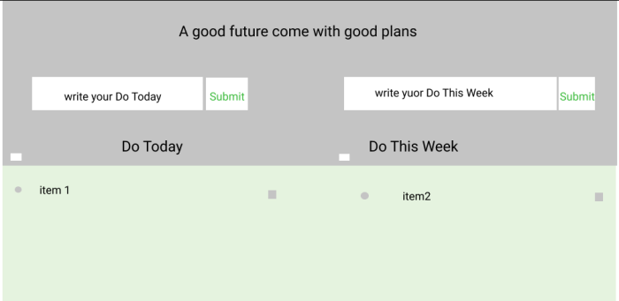

# Development Strategy

> `Encapsulation week 1`

## ToDoList Project

## WIREFRAME

---

### 0. Set-Up

_A User can see my initial repository and live demo_

### Repository

- Created a new repository from this [template](https://github.com/HackYourFutureBelgium/encapsulation-week-1-starter)
- Clone the repository
- Write initial, basic README
- Add a wireframe
- Start the development strategy
- Prepare a project board
- Main Html&Css
- Package JSON install
- Push the changes to GitHub
- Turn on GitHub Pages

### 1. Add Listener to Submit buttons

> As a site visitor, when I click the submit buttons I want to see the text that I have filled it

### Repo

This user story has been developed through a branch called 'listener'.

### HTML

- add id to foms elements and buttons

### CSS

- Nothing has changed

### javascript

-Add event listener two submit buttons.

### 2. Store Inputs into State

> As a site visitor, when I click the submit buttons I want to be sure my todo text is saved .

### Repo

This user story has been developed through a branch called 'storeInput'.

### HTML

- add id to forms elements and buttons

### CSS

- Nothing has changed

### javascript

-Stored Data and Rendered.

### 3.Show completed checkbox

> As a site visitor, when I click the checkbox, I want to see them as completed.

### Repo

This user story has been developed through a branch called 'storeInput'.

### HTML

- add handler js link

### CSS

- Nothing has changed

### javascript

-Stored checkbox when they clicked.

### 4. Remove today todo list

> As a site visitor, when I click the remove icon, so that it can be removed from my todo list.

### Repo

This user story has been developed through a branch called 'delete-todo'.

### HTML

- add handler js link

### CSS

- Nothing has changed

### javascript

-Add Event to remove icon to remove them from todo list.

### javascript

-Stored checkbox when they clicked.

### 5. Select or Unselect All Todo List

> As a site visitor, when I click the checkbox it should select or unselect all todo list and also can change text decoration.

### Repo

This user story has been developed through a branch called 'line-through'.

### HTML

- add handler js link

### CSS

- add text-decoration property

### javascript

-Add Event listener and write some function to achieve goal.
